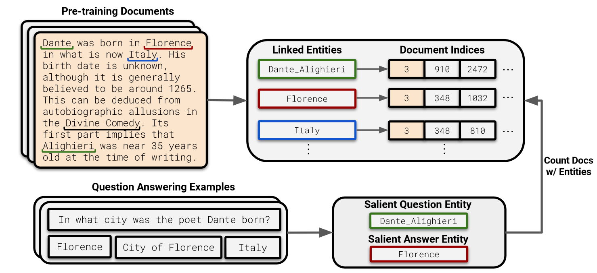

In this paper, the authors show that a language model’s ability to answer fact-based questions is dependent on the related number of documents it pre-trained on. The general observation is that lesser the number of relevant (to the QA pair) documents the model pre-trained on, worse is its QA performance for that particular pair.

## Motivating Questions

1.  Many concepts or much knowledge appears rarely on the Internet (primary source for LLM training), are language models able to learn this knowledge well? How is the LLM’s ability to answer the question affected by the number of related documents seen during the pre-training?
2.  If there is a correlation between the number of relevant documents and the QA performance, does it also mean causation?
3.  How can such long-tail knowledge be better captured? How does model scaling and retrieval-augmentation affect performance on long-tail knowledge?
4.  *What kind* of knowledge language models capture $-$ do they learn “easy” facts that appear more frequently in the pre-training data?

## How?

> [!question]
>
> **How do they find the relevant documents and count them?**
>
> Entity linking the pre-training datasets and the counting documents with the same entities as the QA pair. DBpedia Spotlight Entity Linker is run at massively distributed scale and the entities are linked to DBpedia or Wikidata IDs using traditional entity linking methods. This lets us store the document indices for each entity.
>
> Next, the QA pair is entity linked and the entities from both the question and ground-truth answer is extracted. Once this is done, count the number of documents from the earlier pre-trained dataset entity linking for the extracted QA entities where both the question entity and the answer entity co-occur.

## References

\[1\] Kandpal, Nikhil, et al. “Large language models struggle to learn long-tail knowledge.” *International Conference on Machine Learning*. PMLR, 2023.
